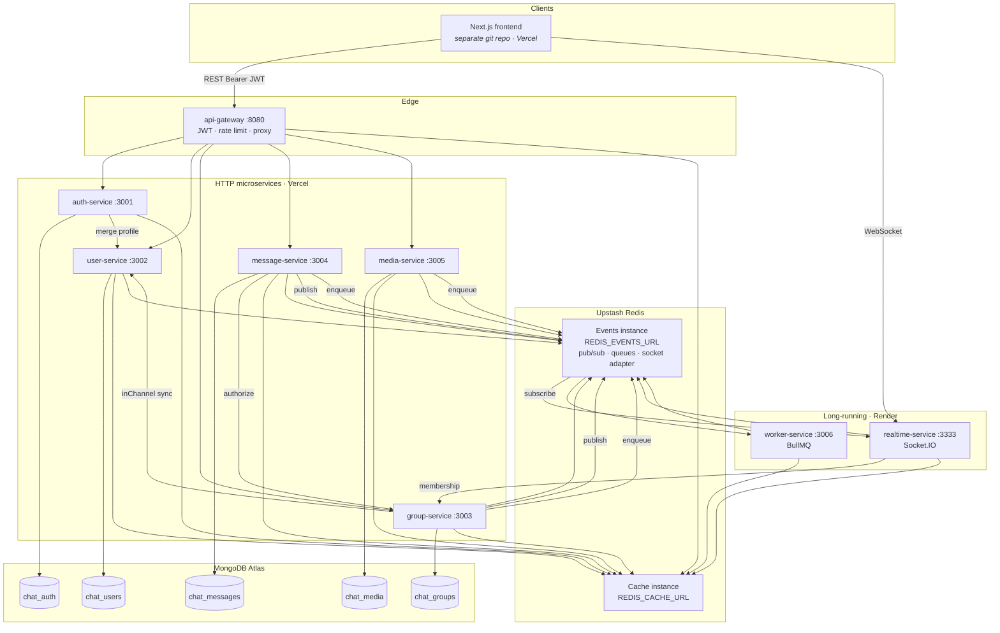
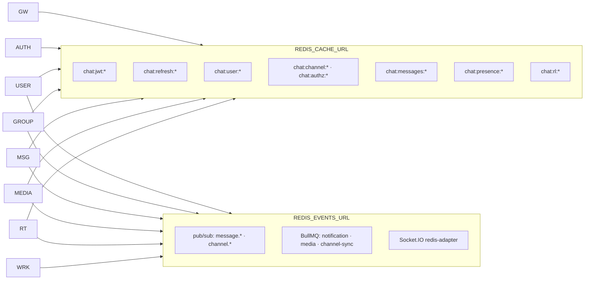
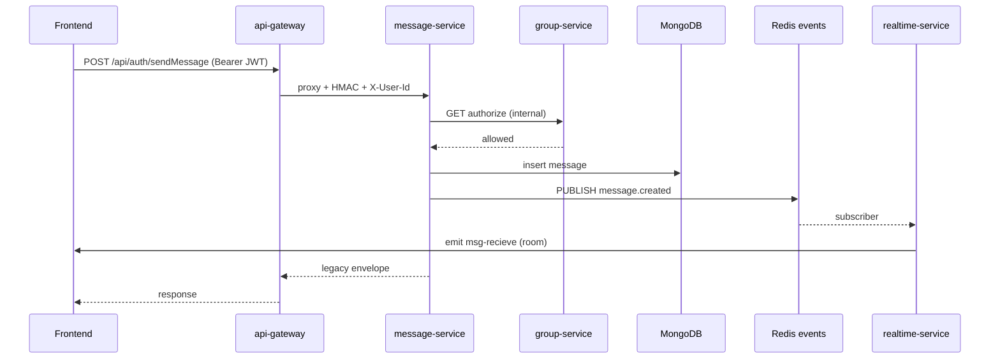
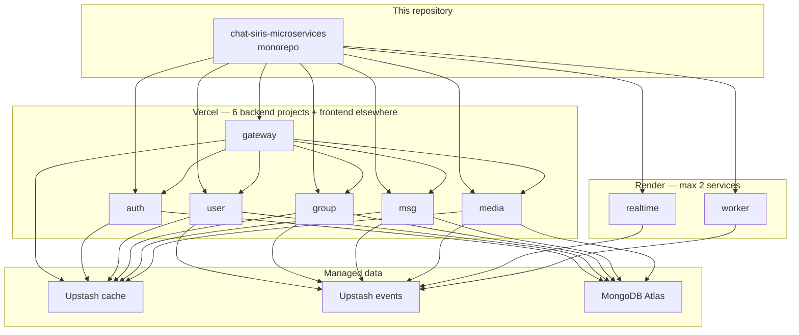

# Chat-Siris v2 — Microservices

Backend platform for **Chat-Siris v2**: API gateway, domain microservices, realtime Socket.IO, and background workers. This repository is the **services monorepo** used for Vercel and Render deployments.

| Lives in **this repo** | Lives in **other repos** |
|------------------------|---------------------------|
| Gateway + 7 microservices + `@chat-siris/logger` | **Frontend** — Next.js (`chat-siris-v2`) |
| `docs/`, `scripts/` | **Legacy monolith** — `Chat-Siris-v2-Server` |

---

## Services overview

| Service | Port (local) | Role | Deploy target |
|---------|--------------|------|----------------|
| [api-gateway](chat-siris-gateway/) | 8080 | Public REST entry, JWT, rate limits, `/api/auth/*` proxy | Vercel |
| [auth-service](chat-siris-auth-service/) | 3001 | Login, register, OAuth, JWT & refresh tokens | Vercel |
| [user-service](chat-siris-user-service/) | 3002 | Profiles, subscribe, `inChannel` | Vercel |
| [group-service](chat-siris-group-service/) | 3003 | Channels, membership, authorization | Vercel |
| [message-service](chat-siris-message-service/) | 3004 | Messages, history, pub/sub publish | Vercel |
| [media-service](chat-siris-media-service/) | 3005 | ImageKit upload-init / complete | Vercel |
| [realtime-service](chat-siris-realtime-service/) | 3333 | Socket.IO, presence, event fan-out | **Render** |
| [worker-service](chat-siris-worker-service/) | 3006 | BullMQ consumers (notification, media, channel-sync) | **Render** |
| [@chat-siris/logger](chat-siris-logger/) | — | Shared logging, HMAC, health helpers | (library) |

Each service has its own `README.md` with API and env details.

---

## System architecture

Clients talk to the **gateway** for REST and to **realtime-service** for WebSockets. Services do not read each other’s MongoDB databases; they coordinate via **internal HTTP** (HMAC-signed) and **Redis** (cache + pub/sub/queues).



---

## Redis: two Upstash instances

Production uses **two URLs**, not `SELECT 0` / `SELECT 1` on one host (Upstash does not support multiple logical DBs).



See [docs/redis-dual-url-migration-plan.md](docs/redis-dual-url-migration-plan.md).

---

## Request flow: send message



---

## Deployment topology

One **Git repo**, many **Vercel projects** (root directory per service) and **two Render web services**.



Full checklist: [docs/vercel-render-deployment-plan.md](docs/vercel-render-deployment-plan.md).

---

## Repository layout

```
.
├── chat-siris-logger/          # Shared npm package (build first)
├── chat-siris-gateway/
├── chat-siris-auth-service/
├── chat-siris-user-service/
├── chat-siris-group-service/
├── chat-siris-message-service/
├── chat-siris-media-service/
├── chat-siris-realtime-service/
├── chat-siris-worker-service/
├── docs/                       # HLD, deployment & Redis plans
└── scripts/
    └── start-dev.js            # Local multi-service launcher
```

---

## Prerequisites

- **Node.js** 20+
- **MongoDB** (Atlas recommended for staging/prod)
- **Redis** — local Docker **or** two Upstash databases (`REDIS_CACHE_URL`, `REDIS_EVENTS_URL`)
- **Frontend** — clone and run from the separate frontend repo for end-to-end UI tests

---

## Local development

### 1. Build the shared logger

```bash
cd chat-siris-logger && npm ci && npm run build && cd ..
```

### 2. Configure each service

Copy `.env.example` → `.env` in each service folder (never commit `.env`).

**Local single Redis:**

```bash
REDIS_URL=redis://127.0.0.1:6379
REDIS_DB_CACHE=0
REDIS_DB_EVENTS=1
```

**Upstash (matches production):**

```bash
REDIS_CACHE_URL=rediss://...
REDIS_EVENTS_URL=rediss://...
```

Use the **same** `INTERNAL_HMAC_SECRET` and JWT key pair across gateway, auth, and realtime.

### 3. Install and run a service

```bash
cd chat-siris-user-service
npm ci && npm run build && npm run dev
```

### 4. Run the full backend stack

From the repo root (starts all services in this repo; **does not** start the frontend repo):

```bash
node scripts/start-dev.js
```

Optional: `node scripts/start-dev.js --only=gateway,auth-service,user-service`

Point the frontend (separate repo) at:

- `NEXT_PUBLIC_GATEWAY_BASE=http://localhost:8080`
- `NEXT_PUBLIC_REALTIME_BASE=http://localhost:3333`

---

## Environment variables (common)

| Variable | Used by | Purpose |
|----------|---------|---------|
| `REDIS_CACHE_URL` | Most services | Upstash cache instance |
| `REDIS_EVENTS_URL` | user, group, message, media, realtime, worker | Pub/sub, BullMQ, Socket.IO adapter |
| `INTERNAL_HMAC_SECRET` | All backends | Service-to-service auth |
| `MONGODB_URI` / `MONGODB_DB_NAME` | Data services | Per-service database |
| `JWT_PRIVATE_KEY` / `JWT_PUBLIC_KEY` | auth (+ realtime for sockets) | RS256 tokens |
| `*_SERVICE_URL` | gateway | Upstream bases in deployment |

Service-specific tables are in each service’s `README.md` and in the [deployment plan](docs/vercel-render-deployment-plan.md).

---

## Health checks

Every HTTP service exposes:

```bash
curl http://localhost:<port>/health
```

Example after local start:

```bash
curl http://localhost:8080/health   # gateway
curl http://localhost:3001/health   # auth
curl http://localhost:3333/health   # realtime
curl http://localhost:3006/health   # worker (+ queue depths)
```

---

## Documentation

| Document | Description |
|----------|-------------|
| [docs/hld-microservices.md](docs/hld-microservices.md) | High-level design and target architecture |
| [docs/vercel-render-deployment-plan.md](docs/vercel-render-deployment-plan.md) | Vercel vs Render placement, deploy order, env matrices |
| [docs/redis-dual-url-migration-plan.md](docs/redis-dual-url-migration-plan.md) | Two Upstash URLs, key namespaces |
| [chat-siris-gateway/README.md](chat-siris-gateway/README.md) | Routes, rate limits, rollback flags |

---

## Inter-service security

Internal routes use **HMAC** (`X-Internal-Signature`, `X-Internal-Timestamp`) via `@chat-siris/logger`. The gateway strips client identity headers and sets trusted `X-User-Id` / `X-User-Email` after JWT validation.

---

## License

UNLICENSED — private project.
