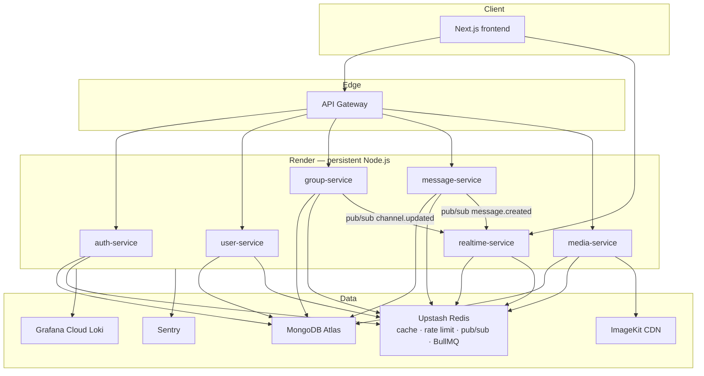
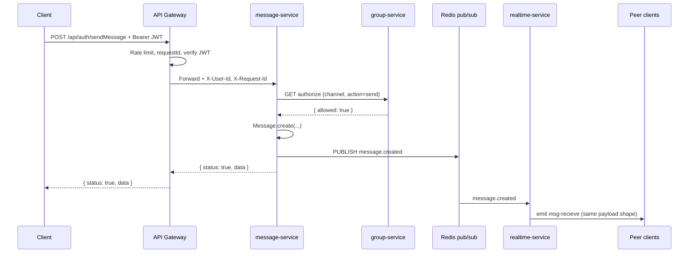
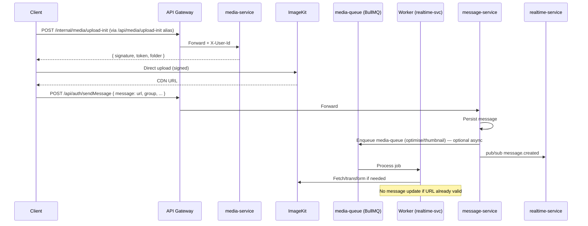
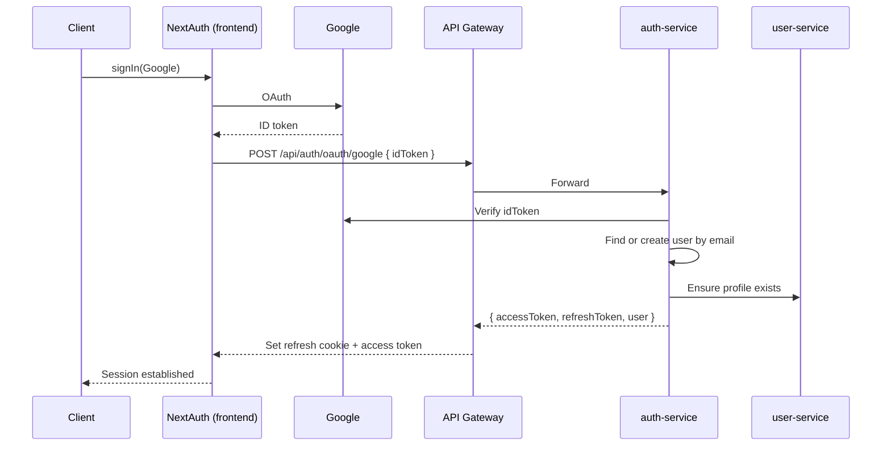

# Chat-Siris v2 — Microservices Migration Architecture

> **Document type:** Target architecture & phased migration plan (no code changes).  
> **Baseline:** Current monolith documented in [`tech-spec.md`](./tech-spec.md).  
> **Constraint:** Backward-compatible REST paths (`/api/auth/*`) and Socket.IO event names unless marked **breaking change**.

---

## 1. Executive Summary

### Problem with the current monolith

The existing `Chat-Siris-v2-Server` bundles authentication, user profiles, channel (group) management, message persistence, real-time delivery, and legacy Tradity endpoints into a single Express process with a shared Mongoose layer. As documented in `tech-spec.md`, this creates several structural problems:

| Issue | Impact |
|-------|--------|
| No server-side authentication | Any client can call any endpoint or socket event |
| Secrets in source (MongoDB URI, ImageKit private key in `NEXT_PUBLIC_*`) | Security and rotation risk |
| Client-side authorization only | Delete message, admin-only chat, password channels bypassable |
| In-memory `onlineUsers` Map | Not horizontally scalable; lost on restart |
| No error middleware, logging, or health checks | Poor operability and debugging |
| Single deployment unit | Cannot scale realtime independently from REST |
| 300-line controller god-object | Violates SRP; hard to test and extend |

### Goals of the migration

1. **Performance** — Scale realtime and media processing independently; cache hot reads (membership, message history, JWT validation).
2. **Security** — Central JWT verification, server-enforced authorization, server-side media uploads, hashed channel passwords, secrets in env only.
3. **Readability & maintainability** — One service per bounded context, shared libraries for cross-cutting concerns (logger, auth headers, Mongoose models).
4. **Backward compatibility** — API Gateway preserves existing `/api/auth/*` routes and `{ status, data/user/group/obj }` response envelope during transition.

### Proposed topology (validated & adjusted)

The reference six-service split is **mostly correct**. One adjustment is recommended:

| Reference proposal | Verdict | Adjustment |
|--------------------|---------|------------|
| API Gateway | ✅ Accept | Add route compatibility layer for legacy paths |
| Auth service | ✅ Accept | Absorb login/register; integrate with Google OAuth exchange |
| User service | ✅ Accept | Profiles + presence metadata (not socket rooms) |
| Group service | ✅ Accept | Rename mentally to **Channel service** (matches domain language in code: `Groups` collection) |
| Realtime service | ✅ Accept with split | **Persistence removed** — only Socket.IO + Redis adapter + pub/sub fan-out |
| Media service | ✅ Accept | Server-side ImageKit proxy (keeps CDN, fixes client key leak) |
| *(not in reference)* | ➕ **Add Message service** | Owns `Messages` CRUD; Realtime consumes events — cleaner SRP than coupling DB writes to sockets |

**Final service count: 7 backend services + 1 gateway + existing Next.js frontend.**



---

## 2. Service Map

| Service | Primary responsibility | Deployment target | Justification |
|---------|------------------------|-------------------|---------------|
| **Next.js frontend** | UI, NextAuth Google session, Recoil state | **Vercel** | Static/SSR optimised; already deployed |
| **API Gateway** | Routing, JWT verify, rate limit, request ID, legacy path proxy | **Render** (Web Service) | Needs stable Redis connection for `rate-limit-redis`; consistent headers to upstream |
| **auth-service** | Register, login, token issue/refresh, Google token exchange | **Render** | Redis-backed refresh tokens; no cold-start token race |
| **user-service** | Profile CRUD, background/avatar/name, user search (future) | **Render** | Persistent MongoDB connection pool |
| **group-service** | Channel CRUD, membership, permissions, password verify | **Render** | Same; authorization rules co-located with group data |
| **message-service** | Message send/get/delete, history pagination | **Render** | Write-heavy; isolated scaling from sockets |
| **realtime-service** | Socket.IO, presence, room join, event fan-out, **BullMQ workers** | **Render** | **Requires long-lived connections**; workers co-located per requirement |
| **media-service** | Upload orchestration, presigned URLs, compression jobs enqueue | **Render** | Large payloads; streaming uploads ill-suited to serverless limits |

**Why not Vercel for backend services:** Vercel serverless functions cannot host Socket.IO, BullMQ workers, or warm MongoDB connection pools reliably. The frontend remains on Vercel; all Node backend services run on Render (or equivalent persistent container platform).

---

## 3. Per-Service Specification

### 3.1 API Gateway

**Owns**
- Public HTTP entrypoint (replaces direct monolith URL for REST)
- JWT validation (access token) via auth-service introspection cache
- Rate limiting (`express-rate-limit` + `rate-limit-redis`)
- `X-Request-Id` generation and propagation
- Reverse proxy to internal services preserving `/api/auth/*` paths
- CORS policy (mirrors current allowed origins)

**Does NOT own**
- Business logic, MongoDB access, Socket.IO
- Token issuance (delegates to auth-service)

**Database collections:** None

**Exposed API surface (external — backward compatible)**

All existing routes proxied unchanged:

| Legacy path | Upstream service |
|-------------|------------------|
| `POST /api/auth/login` | auth-service |
| `POST /api/auth/register` | auth-service |
| `POST /api/auth/updateUser/:id` | user-service |
| `POST /api/auth/deleteBackground/:id` | user-service |
| `POST /api/auth/updateName/:id` | user-service |
| `POST /api/auth/updateAvatar/:id` | user-service |
| `POST /api/auth/addChannelToUser/:id` | user-service |
| `POST /api/auth/createChannel` | group-service |
| `GET /api/auth/getAllChannels` | group-service |
| `POST /api/auth/addUserToChannel/:id` | group-service |
| `POST /api/auth/fetchUserRoom` | group-service |
| `POST /api/auth/findChannelRoute` | group-service |
| `POST /api/auth/channelAdminUpdate/:id` | group-service |
| `POST /api/auth/sendMessage` | message-service |
| `POST /api/auth/getMessages` | message-service |
| `POST /api/auth/deleteMessage` | message-service |
| `POST /api/auth/subscribe` | user-service |
| `GET /health` | gateway (aggregate optional) |

**Public routes (no JWT):** `POST /api/auth/login`, `POST /api/auth/register` only.  
**All other `/api/auth/*` routes:** require valid Bearer JWT at gateway (see §8.3).

**Removed (decision #5):** All Tradity routes (`/tradity`, `/tradityusercheck`, `/tradityusercreate`, `/addtradityimage`, `/removetradityimage`, `/gettradityimage`) — not exposed after migration.

**Internal routes:** `GET /health`

**Inter-service communication**
- **Direct HTTP** to upstream services with injected identity headers (see §9)
- **Redis** for rate-limit counters and JWT validation cache only

**Deployment:** Render Web Service, 1+ instances behind load balancer

---

### 3.2 auth-service

**Owns**
- User registration and login (email lookup — preserves current contract)
- Google OAuth token exchange endpoint (new; replaces NextAuth-only trust model over time)
- Access token (JWT, 15 min) and refresh token (opaque, Redis, 7 days)
- Refresh token rotation and revocation

**Does NOT own**
- Profile fields beyond auth identity (`username`, `avatarImage` set at register — coordinated with user-service)
- Channel membership or messages

**Database:** `chat_auth` (Atlas) — collection `identities`

| Field | Owner |
|-------|-------|
| `_id` | Shared user ID (same as profile `_id`) |
| `email` | auth-service (unique) |
| `googleSub` | auth-service (optional, from Google OAuth) |
| `createdAt`, `updatedAt` | auth-service |

**Does not touch:** `chat_users`, `chat_groups`, `chat_messages`

**Exposed API surface**

| Route | Auth | Notes |
|-------|------|-------|
| `POST /internal/login` | Public | Legacy body `{ email }` → `{ status, user }` |
| `POST /internal/register` | Public | Legacy register body |
| `POST /internal/oauth/google` | Public | Exchange Google ID token → app tokens **(new)** |
| `POST /internal/token/refresh` | Refresh cookie/body | Returns new access token |
| `POST /internal/token/revoke` | Bearer | Logout |
| `POST /internal/token/introspect` | Gateway only | Validates JWT; returns claims (cached) |
| `GET /health` | Public | Health check |

**Inter-service communication**
- **HTTP → user-service:** After register/login, create/fetch profile; **merge** identity + profile into legacy `{ status, user }` response shape
- **Redis:** Refresh token store, login attempt counters, JWT denylist (optional)

**Deployment:** Render Web Service

---

### 3.3 user-service

**Owns**
- User profile CRUD: `username`, `avatarImage`, `isAvatarImageSet`, `backgroundImage`, `admin`, `inChannel`
- Legacy: `subscribe` endpoint only
- User lookup by ID for internal callers

**Does NOT own**
- Authentication, token issuance, email
- Channel document mutations (except `inChannel` pointer updated via coordinated call or event)
- Message content

**Database:** `chat_users` (Atlas) — collection `profiles`

| Field | Owner |
|-------|-------|
| `_id` | Same as `chat_auth.identities._id` |
| `username`, `avatarImage`, `isAvatarImageSet`, `backgroundImage`, `admin`, `inChannel` | user-service |
| `createdAt`, `updatedAt` | user-service |

**Legacy collection:** `subscribes` in `chat_users` (unchanged schema)

**Exposed API surface**

| Route | Maps from legacy |
|-------|------------------|
| `POST /internal/users/:id/profile` | `updateUser`, `updateName`, `updateAvatar`, `deleteBackground` |
| `POST /internal/users/:id/channel-pointer` | `addChannelToUser` |
| `GET /internal/users/:id` | Internal |
| `POST /internal/subscribe` | `subscribe` |
| `GET /health` | — |

**Inter-service communication**
- **HTTP ← group-service:** Update `inChannel` on join/leave
- **Redis pub/sub subscribe:** `channel.member.joined`, `channel.member.left` ( eventual consistency option)
- **Redis cache:** Profile by ID (see §6)

**Deployment:** Render Web Service

---

### 3.4 group-service (Channel service)

**Owns**
- Channel (group) creation, listing, search
- Membership array (`users` embedded snapshots)
- Channel settings: `privacy`, `password`, `adminOnly`, `admin`, `adminId`, `description`
- **Server-side password verification** on join (compare plaintext `groups.password` as today — **no bcrypt migration for now**, decision #4)
- Authorization checks: is user admin, can post (adminOnly), is member

**Does NOT own**
- Message persistence
- Socket room management
- User profile fields except membership snapshots denormalized in `groups.users`

**Database collections**
- **Primary write:** `groups` in `chat_groups`
- **Read-only:** `users` (minimal fields for membership validation via HTTP to user-service preferred)

**Exposed API surface**

| Route | Maps from legacy |
|-------|------------------|
| `POST /internal/channels` | `createChannel` |
| `GET /internal/channels/public` | `getAllChannels` |
| `POST /internal/channels/search` | `findChannelRoute` |
| `POST /internal/channels/lookup` | `fetchUserRoom` |
| `POST /internal/channels/:id/members` | `addUserToChannel` |
| `POST /internal/channels/:id/admin-only` | `channelAdminUpdate` |
| `GET /internal/channels/:id/authorize` | **New internal** — message-service calls before send/delete |
| `GET /health` | — |

**Inter-service communication**
- **HTTP → user-service:** Sync `inChannel` on join/leave
- **Redis pub/sub publish:** `channel.updated`, `channel.member.changed`
- **Redis cache:** Public channel list, membership by channel ID

**Deployment:** Render Web Service

---

### 3.5 message-service

**Owns**
- Message create, list by group (paginated), delete
- Enqueue media placeholder messages when upload pending (optional Phase 3)

**Does NOT own**
- Real-time delivery (delegates via pub/sub)
- Channel permission rules (calls group-service `authorize`)
- File bytes / CDN upload

**Database:** `chat_messages` (Atlas) — collection `messages`

**Exposed API surface**

| Route | Maps from legacy |
|-------|------------------|
| `POST /internal/messages` | `sendMessage` |
| `POST /internal/messages/history` | `getMessages` (paginated — see below) |
| `POST /internal/messages/delete` | `deleteMessage` |
| `GET /health` | — |

#### Message pagination (decision #6)

Cursor-based history — same pattern as Slack/Discord (newest first, scroll up for older). Applied to `POST /api/auth/getMessages`:

**Request body** (backward-compatible path preserved):

```json
{
  "group": "channel-name",
  "limit": 50,
  "before": "507f1f77bcf86cd799439011"
}
```

| Param | Default | Max | Notes |
|-------|---------|-----|-------|
| `group` | required | — | Channel name (unchanged) |
| `limit` | `50` | `100` | Page size |
| `before` | omitted | — | Message `_id` cursor; omit on initial load |

**Response** (extended envelope — non-breaking for clients that ignore extra fields):

```json
{
  "status": true,
  "data": [ "...messages oldest→newest within page..." ],
  "pagination": {
    "hasMore": true,
    "nextCursor": "507f1f77bcf86cd799439011"
  }
}
```

**Server query:** `Message.find({ group, ...(before && { _id: { $lt: before } }) }).sort({ createdAt: -1 }).limit(limit)` → reverse to ascending for UI.

**UI behaviour (Phase 3 frontend update):**
- Initial channel open: request without `before` → latest 50 (up to 100)
- Scroll to top: request with `before: pagination.nextCursor` → prepend older messages
- Realtime append unchanged (`msg-recieve`, local send)
- Delete + `refetchMessages`: reload **latest page only** (not full history)

**Redis cache:** `chat:messages:{channelName}` stores latest 50 aligned with default page (§6.1).

**Inter-service communication**
- **HTTP → group-service:** Authorize send/delete (member + admin rules)
- **Redis pub/sub publish:** `message.created`, `message.deleted`, `messages.refetch`
- **BullMQ enqueue:** `read-receipt-queue` (future), `notification-queue` on new message

**Deployment:** Render Web Service

---

### 3.6 realtime-service

**Owns**
- Socket.IO server with `@socket.io/redis-adapter` (Upstash Redis)
- JWT verification on handshake (`auth.token` in handshake)
- Room join/leave mirroring channel names
- All legacy socket events (same names, same payloads)
- Online presence (Redis sets, not in-memory Map)
- **BullMQ workers** (all queues — per requirement)

**Does NOT own**
- Message or channel persistence (validates via cache or HTTP before relay)
- REST CRUD (except `GET /health`)

**Database collections:** None (Phase 4 target state). During migration straddle, may temporarily read messages — **avoid**; use pub/sub from message-service instead.

**Exposed API surface — Socket.IO events (unchanged names)**

| Event | Direction | Handler behavior |
|-------|-----------|------------------|
| `add-user` | C→S | Register presence in Redis `presence:user:{userId}` |
| `addUserToChannel` | C→S | Verify JWT + membership cache → `socket.join(name)` → emit `channelUpdate` |
| `RemoveUserFromChannel` | C→S | `socket.leave` → emit `channelUpdate` |
| `add-msg` | C→S | **Deprecated path** — prefer REST send + pub/sub; kept for compat: relay only if message ID matches recent cache |
| `refetchChannels` | C→S | Broadcast `fetch` |
| `refetchMessages` | C→S | Emit `fetchMessages` to room |
| `channelUpdate` | C→S | Relay `channelDetailsUpdate` to room |
| `add-member` | C→S | Fix bug: use `channelName` not undefined `room`; emit `userJoined` |
| `msg-recieve` | S→C | Unchanged payload |
| `fetch` | S→C | Unchanged |
| `fetchMessages` | S→C | Unchanged |
| `channelDetailsUpdate` | S→C | Unchanged |
| `userJoined` | S→C | Unchanged |

**Inter-service communication**
- **Redis pub/sub subscribe:** `message.created`, `message.deleted`, `channel.updated`
- **Redis:** Presence, room membership cache, Socket.IO adapter
- **HTTP → group-service:** Membership verify on join (cache miss)

**Deployment:** Render Web Service (minimum 1 instance; scale horizontally with Redis adapter)

---

### 3.7 media-service

**Owns**
- Authenticated upload initiation (presigned ImageKit parameter generation **server-side**)
- Upload completion webhook / callback
- Compression and format normalisation (via `media-queue` worker)
- MIME and size validation

**Does NOT own**
- Message records (returns CDN URL to client or message-service)
- ImageKit account config rotation (env only)

**Database collections**
- **Optional new:** `media_assets` collection for upload metadata (does not break existing schema — messages still store URL in `message.text`)

**Exposed API surface**

| Route | Notes |
|-------|-------|
| `POST /internal/media/upload-init` | Returns signed upload params — **new**; replaces client ImageKit SDK **(breaking change flagged — see below)** |
| `POST /internal/media/upload-complete` | Client notifies URL ready |
| `GET /health` | — |

**Breaking change (Phase 3) — rollout strategy (decision #12)**

See §13 Q12 for plain-language explanation. **Chosen approach: dual-path transition.**

| Phase | Client behaviour | Server behaviour |
|-------|------------------|------------------|
| Phase 3a | Old ImageKit SDK in browser (today) **still works** | `media-service` live; `upload-init` available but optional |
| Phase 3b | Frontend ships `upload-init` flow; remove `NEXT_PUBLIC_IMAGEKIT_PRIVATE` | Both paths accept resulting CDN URLs in `sendMessage` |
| Phase 4 | Client SDK removed | Only server-signed uploads allowed |

**ImageKit retention:** **Keep ImageKit** — mature CDN, already integrated in `MessageCard` URL heuristics.

**Inter-service communication**
- **BullMQ:** `media-queue` producer; worker on realtime-service container
- **HTTP ← message-service:** Optional attach URL after processing

**Deployment:** Render Web Service

---

## 4. Data Ownership Matrix

### 4.1 Resolved: split `users` document (decision #1)

The monolith `users` collection splits into two collections in two databases, linked by the same `_id`:

| Store | Database | Collection | Fields |
|-------|----------|------------|--------|
| **auth-service** | `chat_auth` | `identities` | `_id`, `email`, `googleSub`, timestamps |
| **user-service** | `chat_users` | `profiles` | `_id`, `username`, `avatarImage`, `isAvatarImageSet`, `backgroundImage`, `admin`, `inChannel`, timestamps |

**Login/register response:** auth-service fetches profile from user-service and returns merged `user` object matching today's shape (backward compatible).

**Migration script (Phase 1):** Read existing `users` documents → write `email` to `chat_auth.identities`, remaining fields to `chat_users.profiles`. Monolith DB kept read-only until cutover validated.

### 4.2 Resolved: separate Atlas databases per service (decision #8)

**Decision:** Use **one MongoDB Atlas cluster** with **separate logical databases per service**. This is feasible because:

- No cross-service joins or multi-document transactions are required in application code
- Each service connects with its own `MONGODB_URI` + `dbName` (standard Mongoose pattern)
- Ownership boundaries map cleanly to existing collections
- Independent backup/restore per domain if needed later

| Database | Service | Collections |
|----------|---------|-------------|
| `chat_auth` | auth-service | `identities` |
| `chat_users` | user-service | `profiles`, `subscribes` |
| `chat_groups` | group-service | `groups` |
| `chat_messages` | message-service | `messages` |
| `chat_media` | media-service | `media_assets` *(optional, Phase 3)* |

**Removed collections (decision #5):** `tradityusers`, `images` — not migrated; Tradity routes deleted.

**Cross-service rule:** No service reads another service's database in steady state. Use HTTP + Redis pub/sub only.

### 4.3 Collection summary

| MongoDB collection | Database | Primary owner | Notes |
|--------------------|----------|---------------|-------|
| `identities` | `chat_auth` | auth-service | Was `users.email` + auth linkage |
| `profiles` | `chat_users` | user-service | Was remaining `users` fields |
| `groups` | `chat_groups` | group-service | Embedded `users[]` snapshots unchanged |
| `messages` | `chat_messages` | message-service | Paginated reads (§3.5) |
| `subscribes` | `chat_users` | user-service | Legacy subscribe kept |
| `media_assets` | `chat_media` | media-service | Optional, additive |

### 4.4 Channel passwords (decision #4)

**No hash migration for now.** `groups.password` remains plaintext in MongoDB; group-service verifies with direct string compare on join (same effective behaviour as today's client check, but enforced server-side). Bcrypt deferred to a future hardening pass.

---

## 5. Request Lifecycle Examples

### 5.1 Send text message (post-migration)



**Backward compatibility:** Client may still emit socket `add-msg` during transition; realtime-service relays only if `data.data._id` matches a message created in last 60s (anti-spoof cache). **Deprecation timeline:** Phase 4 docs recommend REST-only send.

### 5.2 Upload image message (post-migration Phase 3+)



**Phase 3 interim:** Client may still use ImageKit SDK until frontend ships new upload flow.

---

## 6. Caching Strategy (Upstash Redis)

### 6.0 Current vs planned caching

This section clarifies what exists in the **monolith today** versus what the migration **introduces**. See also [`tech-spec.md`](./tech-spec.md) for baseline behaviour.

#### Today — no server-side read cache

The current stack has **no Redis, no HTTP cache headers, and no cache in front of MongoDB**. Every REST handler reads/writes Atlas directly.

| Location | Mechanism | Role | Caching? |
|----------|-----------|------|----------|
| `Chat-Siris-v2-Server/index.js` | `global.onlineUsers = new Map()` | Maps `userId → socket.id` on `add-user` | **No** — in-memory lookup only; lost on restart; not shared across instances |
| `chat-siris-v2` — Recoil (`atoms/userAtom.js`) | In-browser atoms | Holds user, channels, messages, loaders for the session | **No** — client session state; cleared on refresh |
| `pages/login.js` | `localStorage` (`chat-siris-2`, `chat-siris-session-2`) | Stores username / Google display name after login | **No** — minimal browser persistence; not used for API reads |
| `pages/api/auth/[...nextauth].js` | NextAuth session cookie | Google OAuth session | **No** — authentication only |
| ImageKit CDN | Edge delivery of uploaded media URLs | Serves files from CDN | **CDN only** — media bytes, not application data |
| MongoDB Atlas | All persistence | Source of truth for users, groups, messages | **N/A** — not a cache layer |

```text
TODAY
  Client (Recoil) ──HTTP──► Monolith ──► MongoDB
  Client (Socket) ────────► Monolith (onlineUsers Map)
```

#### Planned — Upstash Redis as unified cache (and more)

After migration, **Upstash Redis** is the shared store for read caching, rate limits, pub/sub, BullMQ, and the Socket.IO adapter. Keys below use prefix `chat:`.

```text
PLANNED
  Client ──► Gateway ──► Services ──► MongoDB
                │            │
                └── Redis ◄──┘  (cache + rate limits + pub/sub + queues)
```

| Service | Cached entity | Key pattern | TTL |
|---------|---------------|-------------|-----|
| API Gateway | JWT validation | `chat:jwt:{jti}` | 14 min |
| API Gateway | Rate-limit counters | `chat:rl:{scope}:{id}` | window-based |
| auth-service | Refresh tokens | `chat:refresh:{tokenId}` | 7 days |
| auth-service | Session summary | `chat:session:{userId}` | 15 min |
| user-service | User profile | `chat:user:{userId}` | 5 min |
| group-service | Public channel list | `chat:channels:public` | 30 sec |
| group-service | Channel by name | `chat:channel:name:{name}` | 2 min |
| group-service | Member list | `chat:channel:{id}:members` | 1 min |
| group-service | Authz (member/admin/adminOnly) | `chat:authz:{userId}:{channelId}` | 30 sec |
| message-service | Recent messages | `chat:messages:{channelName}` | 2 min |
| realtime-service | Online presence | `chat:presence:user:{userId}` | 60 sec |
| realtime-service | Socket room members | `chat:room:{channelName}:sockets` | 60 sec |
| realtime-service | Legacy `add-msg` anti-spoof | recent message IDs | ~60 sec |

**Same Redis instance, not read caches:** rate limiting (`rate-limit-redis`), pub/sub event fan-out, BullMQ job queues, `@socket.io/redis-adapter` for horizontal socket scaling (Phase 4).

**Implementation status:** All planned caching is **documentation only** until Phase 1+ (Redis provisioned with auth-service / gateway).

---

### 6.1 Planned cache keys (reference)

All keys prefixed `chat:` for namespace clarity.

| Entity | Key pattern | Value | TTL | Invalidation |
|--------|-------------|-------|-----|--------------|
| JWT validation | `chat:jwt:{jti}` | `{ userId, email, roles, exp }` | 14 min (slightly less than 15 min access token) | Logout / revoke |
| Refresh token | `chat:refresh:{tokenId}` | `{ userId, deviceId }` | 7 days | Rotation on use |
| User session summary | `chat:session:{userId}` | `{ userId, email, username }` | 15 min | Profile update event |
| User profile | `chat:user:{userId}` | JSON profile | 5 min | PUT profile |
| Public channels list | `chat:channels:public` | JSON array | 30 sec | `channel.updated` pub/sub |
| Channel by name | `chat:channel:name:{name}` | Channel document | 2 min | channel update |
| Group membership | `chat:channel:{id}:members` | Set of userIds | 1 min | member join/leave |
| Membership authz | `chat:authz:{userId}:{channelId}` | `{ isMember, isAdmin, adminOnly }` | 30 sec | membership change |
| Online presence | `chat:presence:user:{userId}` | `{ socketId, serverId, lastSeen }` | 60 sec (renewed on heartbeat) | disconnect |
| Socket room members | `chat:room:{channelName}:sockets` | Set socketIds | 60 sec | join/leave (via adapter) |
| Recent messages | `chat:messages:{channelName}` | List last 50 message JSON | 2 min | message.created/deleted |
| Rate limit counters | `chat:rl:{scope}:{id}` | counter | window-based | automatic expiry |

**Cache-aside pattern:** Read → miss → MongoDB → set cache. Writes → DB → invalidate/update cache → pub/sub notify.

---

## 7. Queue Design (BullMQ on Redis)

Workers run in **realtime-service** Render container (separate process via `node workers/index.js` or same entry with cluster fork).

### 7.1 `notification-queue`

| Field | Value |
|-------|-------|
| **Producer** | message-service (on `message.created`) |
| **Consumer** | Worker in realtime-service |
| **Payload** | `{ messageId, channelName, senderId, senderName, previewText, memberIds[], requestId }` |
| **Retry** | 3 attempts, exponential backoff 5s → 30s → 2m |
| **Failure** | Dead-letter queue `notification-queue-dlq`; log to Sentry |

**Purpose:** Push FCM/APNs to offline members (future mobile); Phase 1 stub logs only.

### 7.2 `media-queue`

| Field | Value |
|-------|-------|
| **Producer** | media-service (after upload-init complete) or message-service (detects media URL) |
| **Consumer** | Worker in realtime-service |
| **Payload** | `{ messageId?, uploadId, sourceUrl, mimeType, targetFolder, userId, requestId }` |
| **Retry** | 5 attempts, backoff 10s → 1m → 5m |
| **Failure** | DLQ; message remains with original URL |

**Purpose:** Compress video, generate thumbnails, validate MIME. ImageKit transformations may reduce need for heavy processing.

### 7.3 `read-receipt-queue`

| Field | Value |
|-------|-------|
| **Producer** | realtime-service (on future `message.read` event) |
| **Consumer** | Worker in realtime-service |
| **Payload** | `{ userId, channelName, messageIds[], readAt, requestId }` |
| **Retry** | 3 attempts, 5s fixed |
| **Batch** | Worker aggregates up to 100 receipts / 5s window |

**Purpose:** Batch DB writes; **deferred** — no read receipts in current app. Queue scaffold only.

### 7.4 `channel-sync-queue` *(proposed additional)*

| Field | Value |
|-------|-------|
| **Producer** | group-service |
| **Consumer** | user-service worker (or realtime-service) |
| **Payload** | `{ userId, channelName, action: 'join'|'leave', requestId }` |
| **Retry** | 5 attempts, exponential |

**Purpose:** Eventually consistent `users.inChannel` updates without blocking join HTTP response.

---

## 8. Auth & Token Flow

### 8.1 Target model

| Token | Format | Lifetime | Storage |
|-------|--------|----------|---------|
| Access token | JWT (RS256) | 15 min | Client memory / Authorization header |
| Refresh token | Opaque UUID | 7 days | HttpOnly cookie + Redis |

**JWT claims:** `{ sub: userId, email, jti, iat, exp }` — no channel roles in JWT (resolved per request via group-service).

### 8.2 Google login sequence (decision #3 — confirmed)

**NextAuth stays on the frontend for Google OAuth only.** After Google sign-in, the client exchanges the Google ID token for app-issued JWTs via the backend — auth is not split across two trust models long term.



### 8.3 JWT requirement (decision #2 — confirmed)

| Route class | JWT required? |
|-------------|---------------|
| `POST /api/auth/login` | **No** |
| `POST /api/auth/register` | **No** |
| `POST /api/auth/oauth/google` (token exchange) | **No** (uses Google ID token in body) |
| `POST /api/auth/token/refresh` | Refresh token only |
| **All other `/api/auth/*`** | **Yes** — `Authorization: Bearer <accessToken>` |
| Socket.IO handshake (Phase 4+) | **Yes** — `auth.token` in handshake |

Gateway returns `401` with `{ status: false, msg: "Authentication required" }` for missing/invalid JWT (matches existing envelope style).

**Rollout:** Enforced when API Gateway goes live (Phase 1 for new JWT issuance; Phase 2 when all routes proxy through gateway). Frontend must store access token from login/register/oauth response and attach to all axios calls.

### 8.4 Legacy login response (backward compatible)

1. Client POST `/api/auth/login` `{ email }` — no JWT required.
2. auth-service returns `{ status, user }` as today **plus** `accessToken` and sets refresh token cookie.
3. Client uses `accessToken` on all subsequent API calls.

### 8.5 Gateway identity forwarding

After JWT verification, gateway injects:

| Header | Value |
|--------|-------|
| `X-User-Id` | MongoDB `users._id` |
| `X-User-Email` | Email |
| `X-User-Role` | `user` \| `admin` (global app role; channel admin still from group-service) |
| `X-Request-Id` | UUID v4 propagated from gateway |
| `X-Auth-Jti` | JWT ID for audit |

Internal services **trust headers only from gateway** (private Render network; mTLS deferred — decision #10).

### 8.6 Socket.IO auth

```javascript
// Client (future)
io(SERVER_URL, {
  auth: { token: accessToken },
  extraHeaders: { "my-custom-header": "abcd" }  // preserved for compat
});
```

Handshake middleware on realtime-service:

1. Verify JWT (same public key as gateway) or call auth-service introspect (cached).
2. Attach `socket.userId` to socket.
3. Reject connection if invalid — feature-flag `SOCKET_AUTH_REQUIRED=false` during Phase 4 rollout.

---

## 9. Inter-Service Communication Patterns

### Chosen approach: **Hybrid**

| Pattern | Use when | Examples |
|---------|----------|----------|
| **Direct HTTP** | Sync request/response, authorization checks, CRUD | Gateway → services; message → group authorize; auth → user profile create |
| **Redis pub/sub** | Fire-and-forget fan-out, cache invalidation | `message.created` → realtime; `channel.updated` → cache bust |
| **BullMQ** | Async work, retries, batching | Notifications, media processing, read receipts |
| **Shared MongoDB** | **Rejected** for steady state | Avoids coupling; only monolith straddle during migration |

**Justification:** HTTP keeps strong consistency for authz decisions before writes. Pub/sub decouples message persistence from Socket.IO scaling. BullMQ adds reliability for side effects. Shared DB reads were the monolith anti-pattern this migration removes.

**Internal URL discovery:** Render private services `{service-name}:10000` or env vars `USER_SERVICE_URL`, etc.

---

## 10. Observability Setup

### 10.1 Shared Winston + Loki logger

Single npm package `@chat-siris/logger` copied or published internally.

```javascript
// packages/logger/index.js (conceptual — not implemented yet)
const winston = require('winston');
const LokiTransport = require('winston-loki');

const service = process.env.SERVICE_NAME || 'unknown';

const logger = winston.createLogger({
  level: process.env.LOG_LEVEL || 'info',
  format: winston.format.combine(
    winston.format.timestamp(),
    winston.format.json()
  ),
  defaultMeta: { service },
  transports: [
    ...(process.env.NODE_ENV === 'development'
      ? [new winston.transports.Console()]
      : []),
    ...(process.env.LOKI_HOST
      ? [new LokiTransport({
          host: process.env.LOKI_HOST,
          basicAuth: `${process.env.LOKI_USER}:${process.env.LOKI_API_KEY}`,
          labels: { app: 'chat-app', service, env: process.env.NODE_ENV },
          interval: 5,
          json: true,
        })]
      : []),
  ],
});

// Middleware attaches requestId, userId
function logWithContext(req, level, message, meta = {}) {
  logger.log(level, message, {
    timestamp: new Date().toISOString(),
    requestId: req.headers['x-request-id'],
    userId: req.headers['x-user-id'],
    ...meta,
  });
}
```

**Mandatory fields on every line:** `timestamp`, `level`, `service`, `requestId`, `userId` (if authenticated), `message`.

### 10.2 Grafana label strategy

```
{ app="chat-app", service="auth-service", env="production" }
```

**Sample LogQL queries**

```logql
# All errors across all services
{app="chat-app"} | json | level="error"

# Trace a request end-to-end
{app="chat-app"} | json | requestId="abc-123"

# Auth failures in the last hour
{service="auth-service"} |= "unauthorized"
```

### 10.3 Sentry (per service)

- Initialise `@sentry/node` in each service entrypoint
- DSN via `SENTRY_DSN` env var (can share project with `service` tag)
- Capture unhandled exceptions + `Sentry.captureException` in BullMQ failure handlers
- Link to Grafana via shared `requestId` tag

### 10.4 Health check spec

Every service exposes `GET /health`:

```json
{
  "status": "ok",
  "service": "auth-service",
  "uptime": 12345,
  "redis": "ok",
  "mongo": "ok"
}
```

| Field | Rule |
|-------|------|
| `status` | `ok` if all dependencies ok; else `degraded` |
| `redis` | `ok` if `PING` succeeds |
| `mongo` | `ok` if `mongoose.connection.readyState === 1` |

Gateway may expose `GET /health/aggregate` calling each upstream `/health` for Grafana synthetic checks.

### 10.5 Request ID propagation

1. Gateway generates `requestId = uuidv4()` if absent from client.
2. Sets `X-Request-Id` on upstream requests.
3. All services log with same ID.
4. Optional: client sends `X-Request-Id` for support debugging (Phase 2+).

---

## 11. Environment & Deployment Matrix

| Component | Local dev | Staging | Production |
|-----------|-----------|---------|------------|
| **Frontend** | `localhost:3000` | Vercel preview | Vercel `chat-siris-v2.vercel.app` |
| **API Gateway** | `localhost:8080` | Render staging | Render prod + custom domain |
| **auth-service** | `:3001` | Render | Render |
| **user-service** | `:3002` | Render | Render |
| **group-service** | `:3003` | Render | Render |
| **message-service** | `:3004` | Render | Render |
| **realtime-service** | `:3333` (keep port for client compat) | Render | Render |
| **media-service** | `:3005` | Render | Render |
| **MongoDB** | Atlas dev cluster or Docker | Atlas staging | Atlas prod (existing cluster initially) |
| **Upstash Redis** | Upstash dev DB | Upstash staging | Upstash prod |
| **Grafana Cloud** | Console only | Loki staging | Loki prod |
| **Sentry** | Disabled or dev project | Staging DSN | Prod DSN |
| **ImageKit** | Dev keys | Staging folder prefix | Prod CDN |

**Local orchestration:** `docker-compose.yml` (future) with all services + Redis; frontend `.env` points `NEXT_PUBLIC_SERVER_BASE` to gateway or realtime for sockets.

**Rate limits env tuning:**

| Variable | Example |
|----------|---------|
| `RATE_LIMIT_IP` | 100 req / 15 min |
| `RATE_LIMIT_USER` | 300 req / 15 min |
| `RATE_LIMIT_AUTH_LOGIN` | 10 req / 15 min / IP |

---

## 12. Phased Migration Plan

### Phase 1 — Extract auth-service (lowest risk)

**Goal:** JWT issuance, login/register extraction, gateway skeleton, observability baseline.

| Changes | Stays |
|---------|-------|
| New auth-service owns login/register; split script → `chat_auth.identities` + `chat_users.profiles` | Monolith read-only fallback |
| Gateway proxies `/api/auth/login`, `/api/auth/register`; issues JWT on success | Frontend unchanged initially |
| Login/register return `accessToken` + refresh cookie | Monolith handles other routes via gateway passthrough |
| Winston + Sentry in auth + gateway | Socket still on monolith |
| Redis for refresh tokens + rate limits | |

**Rollback:** Gateway route toggle env `AUTH_SERVICE_ENABLED=false` → proxy to monolith login/register.

**Exit criteria:** Login/register parity tests pass; JWT introspect cached; Grafana receiving logs.

---

### Phase 2 — Extract user + group services

**Goal:** Profile and channel logic out of monolith; server-side password verify; authz foundation.

| Changes | Stays |
|---------|-------|
| user-service + group-service live on separate DBs (`chat_users`, `chat_groups`) | message routes on monolith |
| Gateway routes profile + channel paths; **JWT required** on all except login/register | Socket on monolith |
| Tradity routes **removed** from gateway (not proxied) | Response shapes identical for remaining routes |
| group-service: server-side password verify (plaintext compare) | |
| Redis cache for channels/membership | |

**Rollback:** Per-route env flags `USER_SERVICE_ENABLED`, `GROUP_SERVICE_ENABLED`. Monolith controller handlers kept behind flags for 1 release.

**Exit criteria:** Create channel, join, leave, profile update E2E tests; cache hit rate logged; no auth bypass on delete (group-service denies non-admin).

---

### Phase 3 — Extract media + message services

**Goal:** Message persistence isolated; server-side media upload path.

| Changes | Stays |
|---------|-------|
| message-service on `chat_messages`; cursor pagination (default 50, max 100) | Socket event names |
| media-service + dual-path ImageKit (§3.7, §13 Q12) | Old client ImageKit SDK works in 3a |
| Frontend: paginated message load + optional `upload-init` | |
| pub/sub `message.created` → monolith or parallel realtime | |

**Rollback:** Gateway `MESSAGE_SERVICE_ENABLED=false` → monolith message controller.

**Exit criteria:** Messages persist and fan-out correctly; media uploads via new API in staging frontend; queue processing monitored in Grafana.

---

### Phase 4 — Realtime service (most complex)

**Goal:** Move Socket.IO to dedicated service with Redis adapter; BullMQ workers live; decommission monolith.

| Changes | Stays |
|---------|-------|
| realtime-service owns all socket events | Client socket event names unchanged |
| `@socket.io/redis-adapter` on Upstash | `msg-recieve` payload shape |
| JWT socket handshake (flagged rollout) | REST via gateway |
| Monolith **retired**; tag `monolith-final` on `Chat-Siris-v2-Server` (read-only branch, decision #13) | MongoDB schema |
| Workers: notification, media, read-receipt, channel-sync | |
| Fix `add-member` / `room` bug | |

**Rollback:** DNS/env `NEXT_PUBLIC_SERVER_BASE` points back to monolith Render service deployed from `monolith-final` branch (keep deploy artifact for 30 days).

**Exit criteria:** Load test 100 concurrent sockets across 2 realtime instances; presence survives instance restart; zero monolith traffic 48h.

---

### Migration timeline (revised after review — 2026-05-28)

| Phase | Duration estimate | Cumulative | Notes |
|-------|-------------------|------------|-------|
| Phase 1 | 2–3 weeks | 3 weeks | Auth + gateway + JWT day-one + user split one-shot migration |
| Phase 2 | 3–4 weeks | 7 weeks | User + group services; bcrypt for **new** channel passwords only |
| Phase 3+4 *(merged)* | 4–5 weeks | 12 weeks | Message + media + realtime ship together; socket big-bang with rollback vars |
| Hardening | 1–2 weeks | 14 weeks | OTel, optional cost/SLO doc |

**Global release model (review resolution):** Frontend and backend deploy **together** per phase. **No monolith traffic post-release** — no dual-write or read-through straddle for live users.

---

## 13. Resolved Decisions & Remaining Items

All product/architecture questions closed **2026-05-28** unless marked deferred.

| # | Question | **Decision** |
|---|----------|--------------|
| 1 | Split `users` document? | **Yes.** `chat_auth.identities` + `chat_users.profiles`, same `_id`. See §4.1. |
| 2 | JWT on all routes? | **Yes.** Required on all `/api/auth/*` except `login`, `register`, and OAuth token exchange. See §8.3. |
| 3 | NextAuth role? | **Yes.** NextAuth handles Google OAuth on frontend only; backend issues app JWT via token exchange. See §8.2. |
| 4 | Channel password hashing? | **Not now.** Keep plaintext in DB; server-side string compare on join. Bcrypt deferred. See §4.4. |
| 5 | Tradity routes? | **Remove.** All Tradity/subscribe-image endpoints and `tradityusers` / `images` collections dropped from migration scope. `subscribe` kept. |
| 6 | Message pagination? | **Yes.** Cursor-based; default `limit=50`, max `100`; `before` cursor for older pages. See §3.5. |
| 7 | FCM/APNs notifications? | **Ignored.** `notification-queue` remains log-only stub. |
| 8 | Separate DB per service? | **Yes — feasible.** One Atlas cluster, databases: `chat_auth`, `chat_users`, `chat_groups`, `chat_messages`, `chat_media`. See §4.2. |
| 9 | Custom domain for gateway/socket? | **Ignored.** Keep Render/Vercel default URLs until needed. |
| 10 | mTLS between services? | **Deferred.** Render private network only for now. |
| 11 | Read receipts? | **Deferred.** Queue scaffold only; no product feature. |
| 12 | ImageKit upload-init rollout? | **Dual-path.** See explanation below and §3.7. |
| 13 | Monolith repo strategy? | **Keep read-only branch.** Tag `monolith-final` at Phase 4 cutover; archive GitHub repo optional; no further commits on that branch. |

### Q12 explained — ImageKit upload-init rollout

**What is changing?**  
Today the browser uploads files directly to ImageKit using a **private API key embedded in the frontend** (`NEXT_PUBLIC_IMAGEKIT_PRIVATE`). The migration moves signing server-side: the client calls `media-service` → gets a short-lived signed token → uploads to ImageKit → sends the CDN URL in `sendMessage`.

**What are the two rollout options?**

| Strategy | What it means | Risk |
|----------|---------------|------|
| **Big-bang** | Deploy new frontend + media-service together; delete client private key immediately | If deploy fails, **all uploads break** at once |
| **Dual-path** *(chosen)* | Phase 3a: old client SDK still works while `upload-init` is available; Phase 3b: frontend switches to new flow; Phase 4: remove private key | Safer; both paths produce the same CDN URL format in messages |

**Why dual-path:** Chat-Siris supports many media types (image, video, audio, PDF, zip, code files). A gradual switch lets you validate server signing per file type without breaking production uploads.

**End state (Phase 3+4):** `NEXT_PUBLIC_IMAGEKIT_PRIVATE` removed from frontend; all uploads go through `POST /api/auth/media/upload-init` (gateway → media-service).

---

## 14. Architecture Review Resolutions

> Source: [`architecture-migration-review.md`](./architecture-migration-review.md) (2026-05-28)  
> Status: **Critical + improvement issues resolved** via collaborative decisions.

### Global assumptions

| Assumption | Decision |
|------------|----------|
| Monolith after release | **No live traffic** — frontend + backend deploy together per phase |
| User split straddle | **One-shot migration** + pre-cutover validation script; abort if >0.1% records fail |
| Legacy unified MongoDB | **Keep read-only indefinitely** as backup (not dropped) |

### Critical issues

| # | Issue | **Resolution** |
|---|-------|----------------|
| C1 | User split consistency | One-shot migration; no dual-write/read-through (no post-release monolith) |
| C2 | JWT timing vs frontend | **JWT from day one** — login/register/oauth return token; frontend attaches Bearer in same deploy; gateway rejects missing JWT immediately |
| C3 | Phase 3 message delivery gap | **Merge Phase 3 + 4** — message-service + realtime-service same release; Redis `message.created` → realtime |
| C4 | Redis blast radius | **Single Upstash instance, two logical DB indexes:** DB 0 = cache + rate limits + JWT; DB 1 = pub/sub + BullMQ + Socket.IO adapter; document degraded-mode per service |
| C5 | Socket cutover | **Big-bang** with pre-provisioned rollback env vars + `monolith-final` deploy; quarterly rollback drill |

### Improvement suggestions

| # | Issue | **Resolution** |
|---|-------|----------------|
| I1 | Distributed tracing | **OpenTelemetry** — spans across gateway → services → async paths; export to Grafana |
| I2 | Internal trust (no mTLS) | **Render private network + signed internal service token** (HMAC header gateway → services) |
| I3 | Plaintext passwords | **Bcrypt for new channels only** — existing passwords stay plaintext; new/updated passwords hashed |
| I4 | Worker placement | **Separate Render worker service** — scale on queue depth independently of sockets |
| I5 | `inChannel` sync | **HTTP primary + queue fallback** — sync on join/leave; `channel-sync-queue` retries with idempotency key `userId:channelName:action` |
| I6 | Pagination compat | **Strict from day one** — default `limit=50`, max `100`; frontend updated in same release |
| I7 | Testing | **Contract tests in CI** — Jest/supertest per service; snapshot API envelopes; gate phase merges |
| I8 | Data decommission | **Keep unified monolith DB read-only indefinitely** (archive snapshot at cutover) |
| I9 | Cost / SLOs | **Deferred** until staging bills visible |

### Missing information (resolved where applicable)

| # | Topic | **Resolution** |
|---|-------|----------------|
| 7 | Abort conditions | **Manual abort** — on-call decides rollback from Grafana/Sentry (no auto-halt) |
| 9 | Repo structure | **Polyrepo** — one Git repo per service; shared logger published or copied per repo |
| 12 | Pagination cursor | **Compound cursor** — `{ createdAt, _id }` encoded as `before` token |

### Still open / deferred (no decision required before kickoff)

| Topic | Status |
|-------|--------|
| Team size & ownership | Assumed solo/small team — assign owners at implementation start |
| Production traffic profile | Size Redis/Render after staging metrics |
| Full staging mirror | Recommended but not blocking |
| Compliance / GDPR | Not in scope unless requirements emerge |
| Formal cost/SLO doc | Deferred (I9) |
| Incident runbooks | Write per-phase before prod cutover |

---

## Appendix A — Rate Limiting Rules

| Service / scope | Key | Limit | Window |
|-----------------|-----|-------|--------|
| Gateway — global IP | `chat:rl:gw:ip:{ip}` | 100 requests | 15 min |
| Gateway — per user | `chat:rl:gw:user:{userId}` | 300 requests | 15 min |
| auth-service — login | `chat:rl:auth:login:{ip}` | 10 attempts | 15 min |
| auth-service — register | `chat:rl:auth:register:{ip}` | 5 attempts | 1 hour |
| auth-service — refresh | `chat:rl:auth:refresh:{userId}` | 30 | 15 min |
| media-service — upload init | `chat:rl:media:upload:{userId}` | 20 | 1 hour |
| media-service — size | N/A (body limit) | 16 MB video, 25 MB file | per request |
| message-service — send | `chat:rl:msg:send:{userId}` | 60 messages | 1 min |
| realtime-service — connect | `chat:rl:rt:connect:{ip}` | 20 connections | 5 min |

Implementation: `express-rate-limit` + `rate-limit-redis` with Upstash Redis URL; **never in-memory store**.

---

## Appendix B — SOLID & Pattern Mapping

| Principle | Application |
|-----------|---------------|
| **S** — Single Responsibility | Each service owns one bounded context |
| **O** — Open/Closed | New features (read receipts) via new queues/events without changing message API |
| **L** — Liskov Substitution | Gateway upstream interchangeable via env URL |
| **I** — Interface Segregation | Internal APIs minimal; no service exposes full user object to message-service |
| **D** — Dependency Inversion | Services depend on auth headers / events, not concrete Mongoose models of other contexts |

**Patterns used:** API Gateway, Database-per-service (logical), Cache-Aside, Pub/Sub Event Notification, Async Worker (BullMQ), Strangler Fig migration.

---

*Document version: 1.1 — planning only; review resolutions in §14.*
