# Chat-Siris v2 — High-Level Design (Post-Migration)

> **Document type:** Solution architecture HLD  
> **Status:** Target state after Phase 10 cutover (monolith retired)  
> **Sources:** [`tech-spec.md`](../chat-siris-v2/tech-spec.md), [`architecture-migration-plan.md`](./architecture-migration-plan.md), [`migration-acceptance-criteria.md`](./migration-acceptance-criteria.md)  
> **Baseline (retired):** [`tech-spec-old.md`](../chat-siris-v2/tech-spec-old.md) — Express + Socket.IO monolith

---

## 1. Purpose

This document describes the **as-built high-level architecture** of Chat-Siris v2 after migration from a single Express + Socket.IO monolith to a polyrepo microservices platform. The design preserves backward-compatible REST paths (`/api/auth/*`), Socket.IO event names, and the legacy response envelope `{ status, data | user | group | obj, pagination?, msg? }` while introducing JWT authentication, server-enforced authorization, independent scaling, and operational observability.

---

## 2. Architecture Context

| Dimension | Monolith (before) | Microservices (after) |
|-----------|-------------------|------------------------|
| Deployment | Single Express process on port 3333 | 1 gateway + 7 services + 1 worker (Render) + frontend (Vercel) |
| Auth | None on REST or sockets | RS256 JWT (15 min) + refresh tokens; socket handshake auth |
| Authorization | Client-side only | group-service `authorize` endpoint; gateway identity headers |
| Realtime | In-memory `onlineUsers` Map | realtime-service + Redis adapter + pub/sub fan-out |
| Data | Single MongoDB `users`, `groups`, `messages` | Logical DB-per-service on one Atlas cluster |
| Media | Client ImageKit private key in bundle | media-service server-side signing |
| Observability | None | Winston → Loki, Sentry, OpenTelemetry (Phase 11) |

**Migration model:** Frontend and backend deploy together per phase; no post-release monolith traffic. Monolith tagged `monolith-final` and kept as read-only rollback artifact.

---

## 3. High-Level Design Diagram

The diagram below is the **single authoritative HLD** for the migrated system. It shows client entry points, service boundaries, data ownership, async/event paths, and external integrations.

```mermaid
flowchart TB
  subgraph ClientTier["Client Tier — Vercel"]
    FE["Next.js Frontend<br/>NextAuth · Recoil · axiosClient · socket.io-client"]
  end

  subgraph ExternalIdentity["External Identity & CDN"]
    GOOG["Google OAuth"]
    IK["ImageKit CDN"]
  end

  subgraph EdgeTier["Edge Tier — Render"]
    GW["API Gateway :8080<br/>JWT verify · rate limit · requestId<br/>legacy /api/auth/* proxy · HMAC forward"]
  end

  subgraph AppServices["Application Services — Render (persistent Node.js)"]
    direction TB
    AUTH["auth-service :3001<br/>login · register · oauth · JWT issue/refresh"]
    USER["user-service :3002<br/>profiles · subscribe · inChannel pointer"]
    GROUP["group-service :3003<br/>channels · membership · authz · password verify"]
    MSG["message-service :3004<br/>send · history · delete · cursor pagination"]
    MEDIA["media-service :3005<br/>upload-init · upload-complete · MIME/size validation"]
  end

  subgraph RealtimeTier["Realtime Tier — Render"]
    RT["realtime-service :3333<br/>Socket.IO · presence · room join<br/>legacy event names · JWT handshake"]
  end

  subgraph AsyncTier["Async Tier — Render"]
    WRK["worker-service :3006<br/>BullMQ consumers<br/>notification · media · channel-sync · read-receipt stub"]
  end

  subgraph SharedLib["Shared Library"]
    LOG["@chat-siris/logger<br/>Winston · Loki · HMAC · health helpers"]
  end

  subgraph RedisTier["Upstash Redis"]
    direction LR
    R0["DB 0 — Cache & Limits<br/>JWT cache · refresh tokens · rate limits<br/>profile/channel/message caches · presence"]
    R1["DB 1 — Events & Scale<br/>pub/sub · BullMQ queues<br/>@socket.io/redis-adapter"]
  end

  subgraph DataTier["MongoDB Atlas — logical DB-per-service"]
    direction LR
    DBA["chat_auth<br/>identities"]
    DBU["chat_users<br/>profiles · subscribes"]
    DBG["chat_groups<br/>groups"]
    DBM["chat_messages<br/>messages"]
    DBMD["chat_media<br/>media_assets"]
  end

  subgraph Observability["Observability"]
    LOKI["Grafana Cloud Loki"]
    SENTRY["Sentry"]
    OTEL["OpenTelemetry → Grafana Tempo"]
  end

  subgraph Retired["Retired (rollback only)"]
    MONO["Chat-Siris-v2-Server<br/>tag: monolith-final · read-only archive"]
  end

  %% Client flows
  FE -->|"REST Bearer JWT<br/>/api/auth/*"| GW
  FE -->|"WebSocket auth.token<br/>legacy socket events"| RT
  FE --> GOOG
  FE -->|"signed upload (Phase 4)"| IK

  %% Gateway routing
  GW --> AUTH & USER & GROUP & MSG & MEDIA

  %% Service → MongoDB (database-per-service)
  AUTH --> DBA
  USER --> DBU
  GROUP --> DBG
  MSG --> DBM
  MEDIA --> DBMD
  MEDIA --> IK

  %% Inter-service HTTP (sync)
  AUTH -->|"HTTP merge profile"| USER
  GROUP -->|"HTTP inChannel sync"| USER
  MSG -->|"HTTP authorize send/delete"| GROUP
  RT -->|"HTTP membership verify"| GROUP

  %% Redis DB 0 — all services use cache/rate limits
  GW & AUTH & USER & GROUP & MSG & MEDIA & RT --> R0

  %% Redis DB 1 — pub/sub, queues, socket adapter
  MSG -->|"PUBLISH message.created<br/>message.deleted"| R1
  GROUP -->|"PUBLISH channel.updated<br/>channel.member.changed"| R1
  R1 -->|"SUBSCRIBE fan-out"| RT
  RT --> R1
  MSG & MEDIA & GROUP -->|"enqueue jobs"| R1
  R1 --> WRK

  %% Shared logger
  GW & AUTH & USER & GROUP & MSG & MEDIA & RT & WRK --> LOG
  LOG --> LOKI

  %% Observability
  GW & AUTH & USER & GROUP & MSG & MEDIA & RT & WRK --> SENTRY
  GW & AUTH & USER & GROUP & MSG & MEDIA & RT & WRK --> OTEL

  %% Retired monolith (dashed — not in production path)
  MONO -.->|"rollback drill only"| FE

  %% Styling
  classDef client fill:#e8f4fd,stroke:#1976d2
  classDef edge fill:#fff3e0,stroke:#f57c00
  classDef service fill:#e8f5e9,stroke:#388e3c
  classDef realtime fill:#f3e5f5,stroke:#7b1fa2
  classDef data fill:#fce4ec,stroke:#c2185b
  classDef redis fill:#fff8e1,stroke:#fbc02d
  classDef external fill:#eceff1,stroke:#546e7a
  classDef retired fill:#fafafa,stroke:#9e9e9e,stroke-dasharray: 5 5

  class FE client
  class GW edge
  class AUTH,USER,GROUP,MSG,MEDIA service
  class RT realtime
  class WRK service
  class DBA,DBU,DBG,DBM,DBMD data
  class R0,R1 redis
  class GOOG,IK,LOKI,SENTRY,OTEL external
  class MONO retired
```

---

## 4. Diagram Legend

### 4.1 Request paths

| Path | Protocol | Entry | Notes |
|------|----------|-------|-------|
| **A — REST API** | HTTPS | Client → Gateway → service | All `/api/auth/*` except login/register/oauth; JWT required |
| **B — Realtime** | WebSocket (Socket.IO) | Client → realtime-service | Direct connection (not via gateway); JWT in `auth.token` |
| **C — Media upload** | HTTPS + CDN | Client → Gateway → media-service → ImageKit | Server-signed params; CDN URL stored in message via sendMessage |
| **D — Event fan-out** | Redis pub/sub (DB 1) | message/group → realtime | Decouples persistence from socket delivery |
| **E — Async work** | BullMQ (DB 1) | producers → worker-service | Notifications (stub), media processing, channel-sync fallback |

### 4.2 Service responsibilities

| Service | Port | Owns | Does not own |
|---------|------|------|--------------|
| **API Gateway** | 8080 | Routing, JWT, rate limits, requestId, legacy path map | Business logic, DB, sockets |
| **auth-service** | 3001 | Identities, JWT/refresh tokens | Profiles beyond register merge |
| **user-service** | 3002 | Profiles, subscribe, `inChannel` pointer | Channel documents, messages |
| **group-service** | 3003 | Channels, membership, authz, passwords | Message content, socket rooms |
| **message-service** | 3004 | Message CRUD, pagination, pub/sub emit | Realtime delivery, file bytes |
| **media-service** | 3005 | Upload signing, validation, media_assets | Message records |
| **realtime-service** | 3333 | Socket.IO, presence, room events | MongoDB writes (steady state) |
| **worker-service** | 3006 | BullMQ consumers | HTTP API surface |

### 4.3 Data ownership (no cross-service DB reads)

| MongoDB database | Collection(s) | Owner |
|------------------|---------------|-------|
| `chat_auth` | `identities` | auth-service |
| `chat_users` | `profiles`, `subscribes` | user-service |
| `chat_groups` | `groups` | group-service |
| `chat_messages` | `messages` | message-service |
| `chat_media` | `media_assets` (optional) | media-service |

### 4.4 Redis topology

| DB index | Env var | Purpose |
|----------|---------|---------|
| **0** | `REDIS_DB_CACHE=0` | JWT introspect cache, refresh tokens, rate limits, read caches, presence |
| **1** | `REDIS_DB_EVENTS=1` | pub/sub (`message.*`, `channel.*`), BullMQ queues, Socket.IO Redis adapter |

### 4.5 Trust & security boundaries

- **Gateway → services:** Injects `X-User-Id`, `X-User-Email`, `X-User-Role`, `X-Request-Id`, `X-Auth-Jti`, and `X-Internal-Signature` (HMAC-SHA256, ±60s timestamp).
- **Internal routes:** Services reject requests without valid gateway HMAC.
- **Client trust:** Client-supplied identity headers are never trusted without JWT verification at gateway or socket handshake.

---

## 5. Critical flows (reference)

These flows are embedded in the HLD diagram above; summarized here for traceability to acceptance criteria.

**Send message (REST → realtime):** Client `POST /api/auth/sendMessage` → Gateway (JWT) → message-service → group-service authorize → MongoDB write → Redis pub/sub `message.created` → realtime-service → `msg-recieve` to channel room.

**Google login:** Client NextAuth → Google → `POST /api/auth/oauth/google` → auth-service → user-service profile merge → accessToken + refresh cookie → subsequent REST calls use Bearer JWT.

**Channel join:** Client `POST /api/auth/addUserToChannel` → group-service (password verify server-side) → HTTP sync `inChannel` to user-service → optional `channel-sync-queue` on failure → socket `addUserToChannel` on realtime-service after REST success.

---

## 6. Deployment topology

| Component | Platform | Scaling notes |
|-----------|----------|---------------|
| Next.js frontend | Vercel | Static/SSR; env: `NEXT_PUBLIC_GATEWAY_BASE`, `NEXT_PUBLIC_REALTIME_BASE` |
| Gateway + 7 services + worker | Render (Web Services) | Persistent Node.js; warm MongoDB pools; Socket.IO requires long-lived connections |
| MongoDB Atlas | Managed cluster | One cluster; separate logical databases per service |
| Upstash Redis | Managed | Single instance; two logical DB indexes (0 and 1) |
| Grafana Loki / Tempo | Grafana Cloud | Logs and distributed traces |
| Sentry | SaaS | Per-service DSN with `service` tag |
| ImageKit | SaaS CDN | Server private key in media-service only |

---

## 7. Out of scope (deferred)

- Tradity routes and collections (removed; gateway returns 410 Gone)
- FCM/APNs push notifications (`notification-queue` log-only stub)
- Read receipts product feature (queue scaffold only)
- mTLS between services (HMAC internal token used instead)
- Formal cost/SLO document
- Custom domain for gateway/socket (Render/Vercel default URLs)

---

## 8. Related documents

| Document | Purpose |
|----------|---------|
| [`tech-spec.md`](../chat-siris-v2/tech-spec.md) | Implementation-ready component specs and contracts |
| [`architecture-migration-plan.md`](./architecture-migration-plan.md) | Phased migration plan and decisions |
| [`migration-acceptance-criteria.md`](./migration-acceptance-criteria.md) | Phase-gated QA sign-off criteria |
| [`ai-migration-execution-plan.md`](./ai-migration-execution-plan.md) | Agent execution phases and completion status |
| [`chat-siris-gateway/docs/runbooks/`](../chat-siris-gateway/docs/runbooks/) | Rollback and operational runbooks |

---

*Document version: 1.0 — HLD for post-migration Chat-Siris v2 microservices architecture.*
